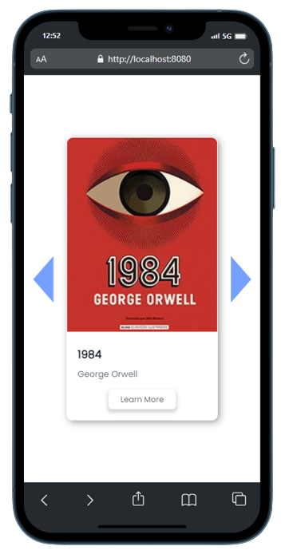

# iLibrary

## Live Demo

Check out the live demo of the app [here](https://tonylig.github.io/Progetto-JavaScript-Advanced-Antonio-Liguori/).

## Description

This project is a web application that allows users to search for books using the Open Library API. Users can enter a search term, and the application will fetch the relevant books from the API and display them. Users can click on a book to view more details and a description.

## Installation

To run the project locally, follow these steps:

1. Clone the repository to your local machine.
2. Open the project directory in your code editor.
3. Install the project dependencies by running the command: `npm install`.
4. Start the application by running the command: `npm start`.

## Usage

1. Open the application in your browser.
2. Enter a search term in the search input field.
3. Click the search button or press Enter to initiate the search.
4. The application will fetch books matching the search term from the Open Library API, and the results will be displayed on the page.
5. Click on a book to view more details and a description.
6. Close the book details by clicking the close button.

## Technologies Used

- HTML
- CSS
- JavaScript
- Open Library API

## License

This project is licensed under the GNU v3 License.

## Contributing

Contributions are welcome! Please refer to the [Contribution Guidelines](CONTRIBUTING.md) for more details.
